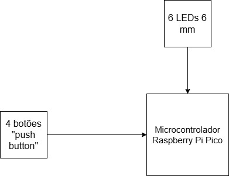

# Genius 💡
Este projeto consiste no desenvolvimento de um sistema embarcado que tem como inspiração o jogo da memória clássico Genius, um disco que dispõe de 4 cores diferentes que acendem em uma ordem aleatória e o jogador precisa adivinhar a sequência correta das cores, utilizando-se de 4 LEDs e  4 botões para representar a sequência reproduzida e a ser inserida pelo jogador.

# Componentes do sistema ⚙
- Microcontrolador Raspberry Pi Pico
- 4 botões "push"
- 6 LEDs difusos 5mm
- Jumpers Macho Macho e Macho Fêmea
- Protoboard

# Requisitos
- UR01: Ser composto por módulos prontos e de fácil acesso 

- UR02: Captar a ordem em que os LEDs são acesos corretamente 

- UR03: Permitir que ao apertar um dos botões, o LED correspondente ao botão seja aceso 

- UR04: Gravar a sequência apertada pelo jogador em um vetor de dados 

- UR05: Utilizar Python como linguagem de programação que configura o ambiente de desenvolvimento (RaspBerry Pi Pico) 

# Funcionalidades 🕹
- 4 LEDs com cores diferentes acendem em ordem aleatória e incremental (um LED pisca primeiro, depois dois, e assim por diante)
- Após os LEDs piscarem, um LED é aceso para indicar ao jogador que é a sua vez de apertar os botões na ordem em que os LEDs piscaram
- Caso o jogador aperte os botões na ordem correta em que os LEDs piscaram, outro LED acende indicando que o jogador passou para a próxima fase
- Caso contrário, todos os LEDs acendem simultaneamente, indicando que o jogador perdeu a rodada e então o jogo é encerrado

# Diagrama de Blocos 

# Integrantes 👷‍♂️
- Felipe Kenzo Ohara Sakae | RA: 22.00815-2
- Lucas Gozze Crapino | RA: 22.00667-2
- Vinicius Garcia Imendes Dechechi | RA: 22.01568-0

