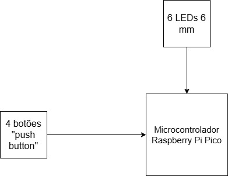
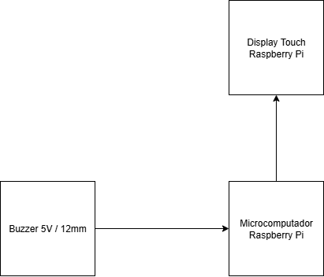
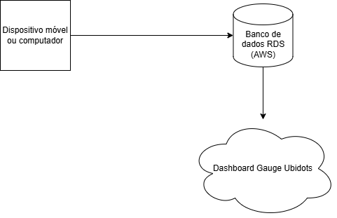
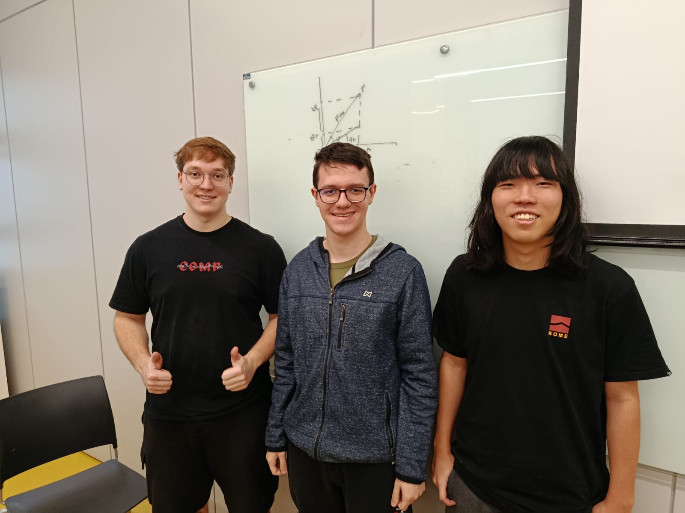

# Genius 💡- T1
Este projeto consiste no desenvolvimento de um sistema embarcado que tem como inspiração o jogo da memória clássico Genius, um disco que dispõe de 4 cores diferentes que acendem em uma ordem aleatória e o jogador precisa adivinhar a sequência correta das cores, utilizando-se de 4 LEDs e  4 botões para representar a sequência reproduzida e a ser inserida pelo jogador.

# Componentes do sistema ⚙
- Microcontrolador Raspberry Pi Pico
- 4 botões "push"
- 6 LEDs difusos 5mm
- Jumpers Macho Macho e Macho Fêmea
- Protoboard

# Requisitos
- UR01: Ser composto por módulos prontos e de fácil acesso 

- UR02: Captar a ordem em que os LEDs são acesos corretamente 

- UR03: Permitir que ao apertar um dos botões, o LED correspondente ao botão seja aceso 

- UR04: Gravar a sequência apertada pelo jogador em um vetor de dados 

- UR05: Utilizar Python como linguagem de programação que configura o ambiente de desenvolvimento (RaspBerry Pi Pico) 

# Funcionalidades 🕹
- 4 LEDs com cores diferentes acendem em ordem aleatória e incremental (um LED pisca primeiro, depois dois, e assim por diante)
- Após os LEDs piscarem, um LED é aceso para indicar ao jogador que é a sua vez de apertar os botões na ordem em que os LEDs piscaram
- Caso o jogador aperte os botões na ordem correta em que os LEDs piscaram, outro LED acende indicando que o jogador passou para a próxima fase
- Caso contrário, todos os LEDs acendem simultaneamente, indicando que o jogador perdeu a rodada e então o jogo é encerrado

# Diagrama de Blocos 

# Genius 💡- T2
Este projeto consiste no desenvolvimento de um sistema embarcado que tem como inspiração o jogo da memória clássico Genius, um disco que dispõe de 4 cores diferentes que acendem em uma ordem aleatória e o jogador precisa adivinhar a sequência correta das cores, utilizando-se de uma interface gráfica em um display touch simulando virtualmente o minigame, com o jogador tendo que pressionar os botões na mesma sequência que estes acenderam.

# Componentes do sistema ⚙
- Microcomputador Raspberry Pi
- Display touch Raspberry Pi
- Dispositivo Buzzer 5V 
- Jumpers Macho/Macho e Macho/Fêmea
- Protoboard 170 pontos
- Cartão de memória SD 128GB

# Requisitos
- UR01: O cartão de memória deve estar configurado no ambiente do Rasberry Pi corretamente, com conexão com internet e visualização dos arquivos clara

- UR02: Ter uma interface gráfica intuitiva e acessível para os jogadores

- UR03: Exibir na tela a sequência aleatória que os botões acendem e armazená-la em um vetor de dados

- UR04: Captar a sequência dos botões pressionados pelo jogador e armazená-la em um vetor de dados

- UR05: Comparar o vetor de dados da sequência dos botões pressionados pelo jogador com o vetor de dados da sequência em que os botões acenderam

- UR06: Utilizar Python como linguagem de programação e demais bibliotecas de suporte, como GPIO Zero para conectar com as portas do Raspberry Pi e Tkinter, para estilização da interface gráfica

- UR07: Disparar o buzzer como um alerta toda vez que o jogador pressionar o botão errado da sequência

# Funcionalidades 🕹
- O jogo se inicia com quatro botões quadriculados serem acesos em uma sequência aleatória e incremental a cada rodada (um botão acende na primeira, dois na segunda, e assim sucessivamente), além dos botões quadriculares, há dois botões circulares: um para indicar que o jogador passou para a próxima rodada e outro indicando que o jogador perdeu a rodada. Há também um contador indicando a rodada que o jogador está
- Após os botões acenderem, o jogador deve pressionar os botões na sequência correta em que acenderam 
- Ao acertar a sequência, o jogador pasa para a próxima rodada, o botão circular verde acende e o contador incrementa para o número da próxima rodada (ex: jogador passou da rodada 1 para rodada 2)
- Caso pressione algum botão errado da sequência, o buzzer dispara um som, o botão circular vermelho acende e o jogador encerra a rodada. Uma mensagem é exibida indicando a rodada em que o jogador conseguiu avançar

# Diagrama de Blocos

# Genius 💡- T3
Este projeto consiste no desenvolvimento de um minigame que tem como inspiração o jogo da memória clássico Genius, um disco que dispõe de 4 cores diferentes que acendem em uma ordem aleatória e o jogador precisa adivinhar a sequência correta das cores, utilizando-se de uma interface gráfica que simula virtualmente o minigame, com o jogador tendo que pressionar ou clicar nos botões na mesma sequência que estes acenderam, e em seguida registrando sua pontuação em um ranking de pontuações de outros, semelhante aos antigos games arcade clássicos dos anos 80 e 90, e podendo visualizar a maior pontuação através de uma plataforma online em nuvem que permite acesso a partir de qualquer dispositivo, de modo que estimule a competitividade do game entre os jogadores da comunidade

# Componentes do sistema ⚙
- Banco de Dados PostgreSQL hospedado no Amazon Relational Database (RDS)
- Dashboard na plataforma online de nuvem Ubidots

# Requisitos
- UR01: Após o término da partida ao errar a sequência, o jogador deve informar seu nome de usuário, composto por 3 caracteres (exemplo: "AAA"), em formato baseado em antigos games arcade de fliperamas dos anos 80 e 90, de forma que o resultado do game esteja atrelado ao nome do usuário.

- UR02: Após o registro do nome de usuário, o jogador retorna para o menu principal, no qual é possível visualizar uma seção de visualização de um placar geral, onde é possível visualizar uma tabela com o resultado de todos os jogadores, em ordem crescente.

- UR03: Os resultados de cada jogador devem ser armazenados no banco de dados para posteriormente exibição na interface gráfica do jogo, em ordem crescente começando pelo usuário que possui a maior pontuação, e o SGBD utilizado para gerenciar o banco é o PostgreSQL.

- UR04: O banco de dados deve estar hospedado utilizando o serviço da AWS denominado Relational Database Service (Amazon RDS), cuja finalidade é hospedar bancos de dados do tipo relacional.

- UR05: O sistema deve fazer uma requisição da maior pontuação obtida no jogo utilizando o protocolo HTTP para a plataforma cloud Ubidots, onde será possível visualizar um dashboard com a maior pontuação de rodadas, entre 0 e 20 pontos, considerada a pontuação mais difícil de se obter.

- UR06: O código deve conter a chave de API gerada pela plataforma Ubidots para enviar a requisição HTTP do tipo POST (envio de dados para o servidor).

- UR07: A requisição HTTP deve retornar um código numérico informando sucesso ou fracasso de requisição.

- UR08: O usuário deve visualizar sua pontuação a partir de qualquer dispositivo que utilizar, por conta dos dados estarem armazenados no banco de dados hospedado pela AWS, e o dashboard estar presente na plataforma da Ubidots, bastando apenas possuir as credenciais necessárias para acessar os resultados e dashboard de forma online, além dos mesmos estarem em funcionamento.

# Funcionalidades 🕹
- O jogo se inicia com quatro botões quadriculados serem acesos em uma sequência aleatória e incremental a cada rodada (um botão acende na primeira, dois na segunda, e assim sucessivamente), além dos botões quadriculares, há dois botões circulares: um para indicar que o jogador passou para a próxima rodada e outro indicando que o jogador perdeu a rodada. Há também um contador indicando a rodada que o jogador está
- Após os botões acenderem, o jogador deve pressionar os botões na sequência correta em que acenderam 
- Ao acertar a sequência, o jogador pasa para a próxima rodada, o botão circular verde acende e o contador incrementa para o número da próxima rodada (ex: jogador passou da rodada 1 para rodada 2)
- Caso pressione algum botão errado da sequência, o buzzer dispara um som, o botão circular vermelho acende e o jogador encerra a rodada. Uma mensagem é exibida indicando a rodada em que o jogador conseguiu avançar.
- Após a rodada encerrar, é solicitado ao jogador que escreva seu nome em até três caracteres utilizando letras maiúsculas, seguindo o formato de antigos games de fliperama, para registrar a pontuação do jogador na rodada em que ele parou
- O jogador então, volta ao menu principal, onde existe uma funcionalidade de visualização de placar geral, na qual é apresentado uma tabela com as pontuações de todos os jogadores em ordem crescente da maior pontuação para a menor.
- Caso a tabela esteja muito grande com muitos usuários e o jogador queira acessar somente a maior pontuação para tentar superá-la, é possível acessar a plataforma online Ubidots, que possui um dashboard indicando a pontuação máxima obtida por um jogador entre 0 e 20.

# Diagrama de Blocos

# Integrantes 👷‍♂️
- Felipe Kenzo Ohara Sakae | RA: 22.00815-2
- Lucas Gozze Crapino | RA: 22.00667-2
- Vinicius Garcia Imendes Dechechi | RA: 22.01568-0

Observação: Para fins de segurança, dados como nome do banco de dados, usuário e senha do banco de dados e a chave API do Ubidots foram colocados em um arquivo .env que não estará presente no GitHub, como consta no arquivo .gitignore